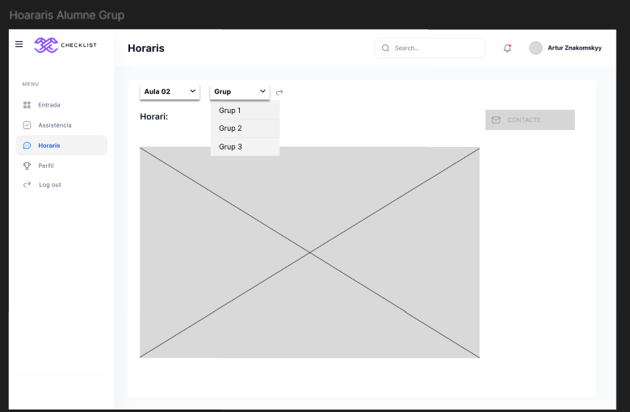

# ProjSprint1 DAW

## LOG IN

Una pàgina de login, on per accedir s'haurà d'introduir l'email i la contrasenya. També hi haurà un enllaç per si es perd la contrasenya.

## CONTRASENYA OBLIDADA

Apartat de contrasenya oblidada, on s'haurà d'introduir el correu electrònic i la confirmació del mateix per poder recuperar la contrasenya.

## ENTRADA ALUMNE/PROFESSORS

Apartat d'entrada on, un cop iniciem sessió, apareixen les notificacions diàries, amb un filtre que permet escollir per temes (per exemple, si volem veure qui ens ha escrit o el que hem escrit nosaltres). També hi ha un cercador per trobar informació de manera més directa. A més, apareix el nom de l'usuari, que en clicar-hi ens porta a l'apartat de perfil, i un menú desplegable amb els diferents apartats de la pàgina.

## ASSISTÈNICA PROFES

A l'apartat d'Assistència profe, es mostrsa com veuria aquest apartat el professor. Hi tindria uns menús desplegables per consultar l'assistència d'un alumne per nom, data, aula o grup. També disposaria d'un filtre per veure específicament els retards, les faltes o les assistències de l'alumne. A més, hi hauria dos botons per passar llista o modificar-la.

## PASSAR LLISTA, PROFES

A l'apartat de passar llista, el professor pot fer l'assistència dels alumnes i, en acabar, guardar-la fent clic al botó Passar Llista.

## MODIFICAR LLISTA, PROFES

A l'apartat de modificar llista es podrà accedir donant-li al botó modificar. D'aquesta manera, si algun alumne arribés tard, es podria modificar posant-li un retard. La modificació es guarda clicant el botó modificar.

## ASSISTÈNCIA ALUMNES

A l'apartat d'assistència alumne, la visualització seria igual a la dels professors, però l'alumne no podria ni passar llista ni modificar res.

## HORARIS ALUMNES

A l'apartat d'horaris alumne, es pot accedir als diferents horaris amb dos menús desplegables, un per aula i un altre per grup, això per facilitar la cerca de l'horari.

## HORARIS PROFES

A l'apartat d'horari profe, hi ha la mateixa funcionalitat, però amb la possibilitat de modificar els horaris.

## PERFIL

A l'apartat perfil trobem tota l'informació de l'usuari. També hi ha un enllaç a dades de l'usuari on ens portaria a un altre apartat que es on podriem editar les nostres dades. 

## EDITA USUARI

A l'apartat edita usuari tenim totes les dades en una casella la qual podem editar per si trobem algun error. Al costat també podem modificar la foto que tenim pujant-la a la casella. Aquestes modificacions es farien nomès si es clica el botó actualitza.

## LOG OUT

Per úlitm, trobem l'apartat log out, on, al clicar el botó log out apareixeria una alerta per confirmar si volem sortir del compte, amb dos botons: de cancel·lar i acceptar, on donant-li a acceptar es sortiria del compte.

# ProjSprint2 DAW

## MOIFICACIONS FIGMA
Les modificacions per aquesta entrega de wireframe d'alta qualitat han sigut la divisió de la part de l'alumne i el professor, afegint també noves funcions a les dues parts:

## LOG IN I CONTRASENYA OBLIDADA
El log in i la contrsenya oblidada segueixen igual tan per a la part de l'alumne com a la del professor.

## ENTRADA
A La safata d'entrada he afegit com es veuria el filtre que es troba d'amunt de tota la informació:

Aquesta secció és igual per alumnes com a professors, tenim un filtre on podem navegar per veure els misstages, informació no llegida O missatges destacats...

## PERFIL I LOG OUT
perfil i log out a ambdós casos seguiex igual.

## ALUMNES: A partir d'aquí començare amb les modificacions de l'alumne.

## ASSISTÈNCIA
A l'assistència tambe he fet funcional com a exemple un filtre, on tots faríen el mateix treball.
La pàgina original d'assistència quedaria igual el canvi vindria aqui:

El filtre disposarà de tres opcions, amb Assistit, Retard i Absència on és podra veure quan un alumne a faltat a clase, a arribat tard o a vingut, això també amb l'ajuda delS altres filtres on podriem veure-ho exactament.

## HORARI
Al horari els canvis també serien per fer funcionals els filtres per a poder buscar un horari:

El filtres ens ajudaran a buscar l'aula i el grup en concret per poder buscar el horari que volem.

## PROFESSOR: A partir d'aquí començare amb les modificacions del professor.

## ASSITÈNCIA:
A la part d'assistència del porfessor la funcionalitat de passar llista i modificar la llista segueix sent igual, els canvis fets són també per la part de filtres que tendrien la mateixa funcionalitat que a la part d'alumnes.

Aquí els filtres ajudarien a veure al professor quan han vingut, arribat trad o no han vingut els alumnes, tan mateix el filtre funciona amb retard i absència com a l'apartat dels alumnes.

## HORARI:
A la part de l'horari del professor he afegit els filtres com a l'apartat del alumens i també l'opció d'afegir un horari:

Aquí la modificació d'afegir un horari permetrà al porfessor afegir un horari al grup i aula corresponent i els filtres per buscar un horari segueixen tenint la mateixa funcionalitat que a la dels alumnes.

# GUIA D'ESTILS SPRITN2 DAW
A la guia d'estils he afegit, els logos que farém servir, la paleta de colors i la tipografía utilitzada.

## LOGOS
Començarem pels logos:

He posat dos opcions de logos on un servirà per quan treballem amb la versió original i l'altre per a la versió fosca, també de cada logo he fet dos versions, el vertical que és farà servir per a la part del logo i contrasenya oblidada i l'horizontal per posar-la a cada apartat de la web.

## PALETA DE COLORS
Seguidament tenim la paleta de colors:

La paleta de colors l'he fet veient els colors que utilitzem a la web.

## TIPOGRAFÍA 

Tan mateix amb la tipografía, he posat els diferents tipus de fonts utlitzats(veient a Google fonts si estàn).